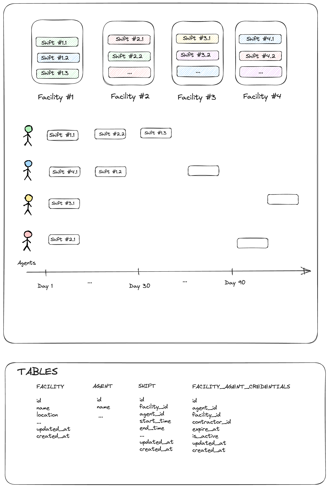

# Ticket Breakdown
We are a staffing company whose primary purpose is to book Agents at Shifts posted by Facilities on our platform. We're working on a new feature which will generate reports for our client Facilities containing info on how many hours each Agent worked in a given quarter by summing up every Shift they worked. Currently, this is how the process works:

- Data is saved in the database in the Facilities, Agents, and Shifts tables
- A function `getShiftsByFacility` is called with the Facility's id, returning all Shifts worked that quarter, including some metadata about the Agent assigned to each
- A function `generateReport` is then called with the list of Shifts. It converts them into a PDF which can be submitted by the Facility for compliance.

## You've been asked to work on a ticket. It reads:

**Currently, the id of each Agent on the reports we generate is their internal database id. We'd like to add the ability for Facilities to save their own custom ids for each Agent they work with and use that id when generating reports for them.**


Based on the information given, break this ticket down into 2-5 individual tickets to perform. Provide as much detail for each ticket as you can, including acceptance criteria, time/effort estimates, and implementation details. Feel free to make informed guesses about any unknown details - you can't guess "wrong".


You will be graded on the level of detail in each ticket, the clarity of the execution plan within and between tickets, and the intelligibility of your language. You don't need to be a native English speaker, but please proof-read your work.

## Your Breakdown Here



### Ticket #1

Title - Allow facility owners to register agents with a contractor id

Description - Facility owners would like to keep track of agents with a contractor id generated by their systems. We should provide facility owners the ability to register agents with a contractor id. These contractor ids are scoped to a facility and only facility owners and agents are allowed to access it. 

Facility owners can - 
- provision new contractor ids
- deactivate contractor ids


Acceptance Criteria

- Create a new table called FACILITY_AGENT_CREDENTIALS with the following columns

    ```
    id  (auto increment unqiue id)
    agent_id (internal reference to agent)
    facility_id (internal reference to facility)
    contractor_id (contractor id added by the facilty)
    is_active (boolean)
    updated_at
    created_at
    ```

- Create a new endpoint `POST /provision` which will allow facility owners to register the agent to their facility with a contractor id provided by them. API should return `201 Created` for success

    Sample Payload 

    ```
    {
        agent_id
        facility_id
        contractor_id
    }
    ```

- An agent can have only one active contractor id per facility, `POST /provision` should return `400 Bad Request` if API consumer is providing invalid details or trying register multiple contrator_id(s) for the same agent in a given facility

- Update the `GET /facility/{facility_id}/agent/{agent_id}` API to fetch the new contractor id

    Sample Response

    ```
    {
        ...
        contractor: {
            id: contractor_id,
            is_active: boolean,
            updated_at: timestamp
        }
    }
    ```

- Update the `PATCH /facility/{facility_id}/agent/{agent_id}` API allow deactivation of contractor ids

    Sample Payload

    ```
      [{ "op": "replace", "path": "/contractor/is_active", "value": false }]
    ```

- All APIs should be protected with proper security context header. API should return `401 Unauthorized` if a FO is passing invalid context or trying to modify resources not owned by them.


- All APIs should return errors in the following format 

    Sample Response for 400
    ```
    {
       name: 'INVALID_REQUEST',
       message: 'Request is not well formed',
       debug_id: '0x1234',
       details: [{
        issue: 'MISSING_REQUIRED_PARAMETER',
        description: 'contractor_id is required',
        field: '/contractor_id',
        location: 'body'
       }]
        
    }
    ```
    
    Sample Response for 500
    ```
    {
        name: 'INTERNAL_SERVER_ERROR',
        message: 'An internal server error has occured',
        debug_id: '0x1234'
    }
    ```


Estimate - 6 days

### Ticket #2

Title - Modify the getShiftsByFacility procedure to return the new contractor id with agent metadata

Description - FOs are using the getShiftsByFacility procedure to generate reports. It currently contains only the internal_id generated by our system. Update the procedre to return the new contractor id with agent metadata

Acceptance Criteria

- Add the contractor object to `SHIFT` list returned by getShiftsByFacility

```
    shifts = [{
        ...

        agent: {
            ...
            contractor: {
                id: ''
                ...
            }
        }

    }]
```

Estimate - 1/2 day


### Ticket #3

Title - Modify the generateReport procedure and add the contractor id the PDF reports

Description - FOs use the procedure to generate a PDF for their compliance requirements. They would like to track agents with contractor id instead of the agent_id. 


Acceptance Criteria

- Add contractor_id column to PDF report
- Remove agent_id column from PDF report

Estimate - 1/2 day


